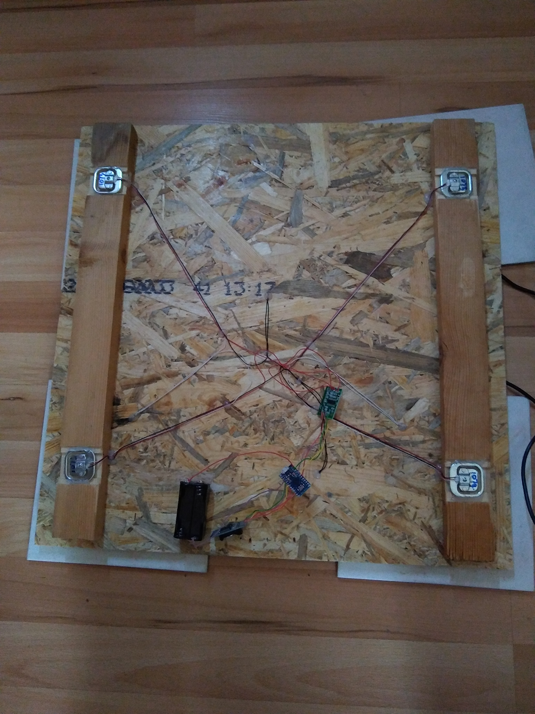

# Bee weighter

The data the testing run harvested are available in
[data.ods](./docs/data.ods). An excerpt:

```
674488892	14		16.05.2021 14:01:32
674488895	7			16.05.2021 14:01:35
674489230	0			16.05.2021 14:07:10
674489233	1			16.05.2021 14:07:13
674489236	5165	16.05.2021 14:07:16
674489239	-181	16.05.2021 14:07:19
674489242	-139	16.05.2021 14:07:22
674489245	-93		16.05.2021 14:07:25
674489258	2			16.05.2021 14:07:38
674489261	5			16.05.2021 14:07:41
674489264	9			16.05.2021 14:07:44
```

## Quadruple strain

Using four single strain half bridges together again forms a full bridge,
with the resistance doubled. **200kg max.**


## Bottom side

The bottom side for testing looked like this initially:


## Commands

Load the code into the Arduino Pro Micro 3.3V:

```
pio run -t upload
```

## License

MIT
